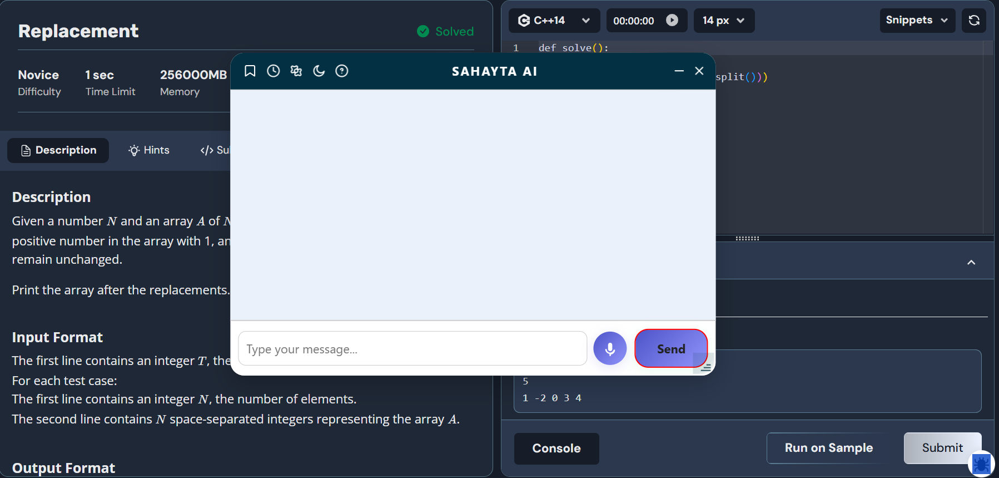
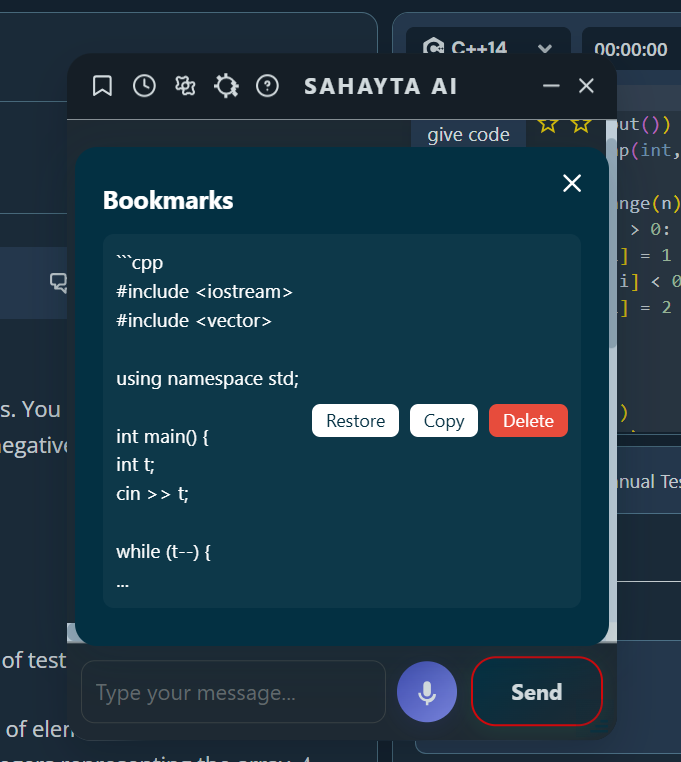
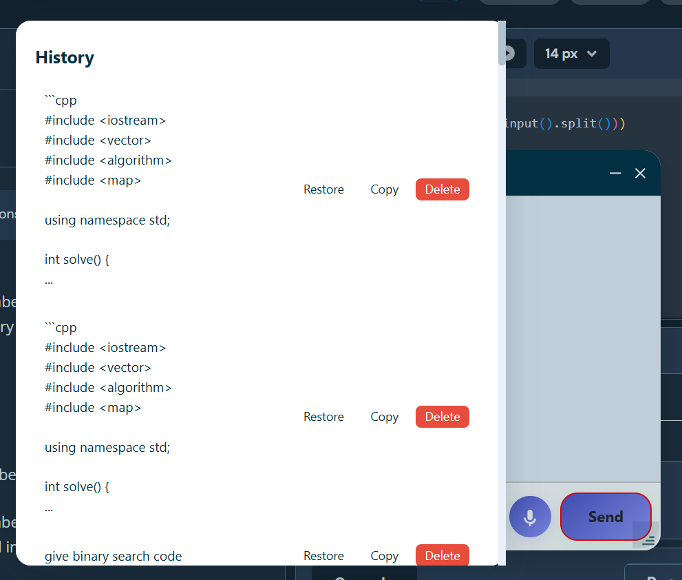
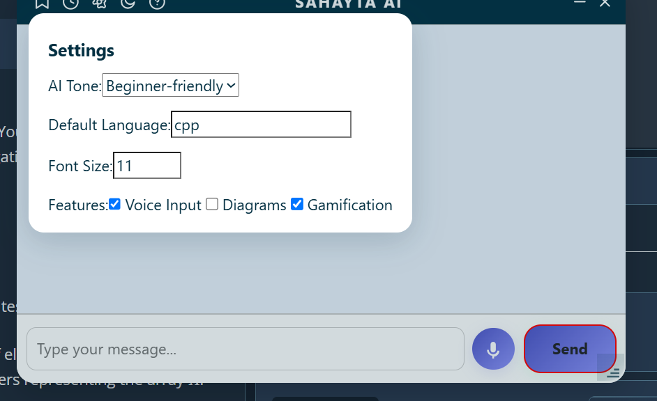
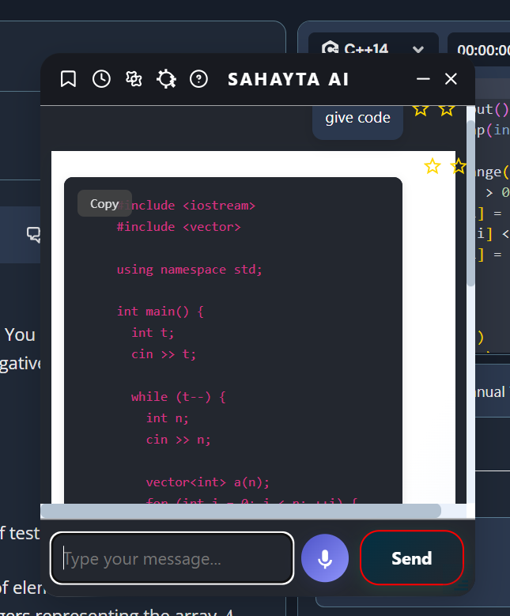

# Sahayata AI: Coding Assistant Chrome Extension


## Table of Contents
- [Overview](#overview)
- [Features](#features)
- [Installation](#installation)
- [Usage](#usage)
- [Settings & Preferences](#settings--preferences)
- [Bookmarks & History](#bookmarks--history)
- [Voice Input](#voice-input)
- [Gamification](#gamification)
- [Accessibility & Shortcuts](#accessibility--shortcuts)
- [Screenshots](#screenshots)
- [Demo Videos](#demo-videos)
- [Troubleshooting](#troubleshooting)
- [Contributing](#contributing)
- [License](#license)

---

## Overview

**Sahayata AI** is a powerful Chrome extension that brings an AI-powered coding assistant directly to your favorite coding platforms. With a single click, you can ask coding questions, get code explanations, generate code in your preferred language, and manage your learning with bookmarks, history, and gamification features—all in a beautiful, accessible, and modern UI.

---

## Features

### 🧠 AI Coding Assistant
- Ask coding questions and get instant answers powered by Google Gemini.
- Supports code generation, explanations, and conceptual help.
- Markdown and code block rendering with IDE-like styling.
- Copy code to clipboard with a single click.

### 🎨 Modern, Responsive UI
- Draggable, resizable chat modal with dark/light mode.
- Accessible design with ARIA labels and keyboard navigation.

### 🌐 Multi-Language Support
- Set your preferred programming language (e.g., C++, Python, JavaScript).
- AI will generate code in your chosen language by default.

### 🗂️ Bookmarks & History
- Bookmark any message for quick access later.
- View and restore previous conversations from history.
- Copy or delete bookmarks and history entries.

### 🎤 Voice Input
- Dictate your questions using your microphone (if enabled).
- Visual feedback while listening.

### 🏆 Gamification
- Earn points and streaks for asking questions and using features.
- Achievements for first streak, bookmarks, and more.

### ⚙️ Customizable Settings
- Set preferred language, tone (concise, detailed, beginner-friendly), and font size.
- Enable/disable features: Voice Input, Diagrams, Gamification.
- All preferences are respected by the AI in its responses.

### 🛠️ Accessibility & Shortcuts
- Full keyboard navigation and ARIA support.
- Keyboard shortcuts:
  - `Ctrl+B`: Open Bookmarks
  - `Ctrl+H`: Open History
  - `Ctrl+K`: Open Settings
  - `Esc`: Close modals

---

## Installation

1. **Clone or Download the Repository**
   ```bash
   git clone <your-repo-url>
   ```

2. **Load the Extension in Chrome**
   - Go to `chrome://extensions/`
   - Enable "Developer mode"
   - Click "Load unpacked"
   - Select the `Final Code/` directory

3. **Pin the Extension**
   - Click the puzzle icon in Chrome and pin "Sahayata AI" for easy access.

---

## Usage

1. **Open a Supported Coding Platform**
   - The extension works on most coding websites (e.g., LeetCode, Codeforces, etc.).

2. **Click the AI Help Button**
   - Look for the  icon next to the "Ask Doubt" button.

3. **Ask Your Question**
   - Type or dictate your coding question.
   - Press "Send" or use voice input.

4. **Interact with the Response**
   - Copy code, bookmark messages, or ask follow-up questions.
   - Use keyboard shortcuts for quick access.

---

## Settings & Preferences

- **Preferred Language:** Set your default programming language (e.g., C++, Python). The AI will use this for code unless you specify otherwise.
- **Tone:** Choose how detailed or beginner-friendly you want the AI's responses.
- **Font Size:** Adjust the chat font size for comfort.
- **Features:** Enable or disable Voice Input, Diagrams, and Gamification.

All preferences are sent to the AI and respected in its responses.

---

## Bookmarks & History

- **Bookmark:** Click the star icon next to any message to save it.
- **History:** Access your last 200 messages, restore or copy any previous answer.
- **Manage:** Delete, copy, or restore bookmarks and history entries.

---

## Voice Input

- Click the microphone button to dictate your question.
- Visual feedback shows when the extension is listening.
- Requires microphone permissions.

---

## Gamification

- Earn points for asking questions, bookmarking, and streaks.
- Achievements for first streak, first bookmark, and more.
- View your points and achievements in the settings.

---

## Accessibility & Shortcuts

- Fully accessible with ARIA labels and keyboard navigation.
- Keyboard shortcuts for all major features.
- Dark and light mode toggle for visual comfort.

---

## Screenshots

> **Replace the image paths with your actual screenshots.**

### Main Chat Modal


### Bookmarks & History



### Settings


### Code Block Example


---

## Demo Videos

> **Upload your demo videos to a platform (YouTube, Loom, etc.) and link them here.**

- [Feature Walkthrough (YouTube)](https://www.youtube.com/watch?v=YOUR_VIDEO_ID)
- [How to Use Bookmarks & History](https://www.youtube.com/watch?v=YOUR_VIDEO_ID)
- [Settings & Preferences Demo](https://www.youtube.com/watch?v=YOUR_VIDEO_ID)

---

## Troubleshooting

- **AI not responding?**  
  Check your API key and network connection.
- **Code not in preferred language?**  
  Make sure you set your preferred language in settings.
- **Voice input not working?**  
  Ensure microphone permissions are granted.
- **CSP/Script errors?**  
  All scripts and styles are loaded locally; make sure you have no external CDN references.

---

## Contributing

Contributions are welcome! Please open issues or pull requests for new features, bug fixes, or improvements.

---

## License

This project is licensed under the MIT License. See [LICENSE](LICENSE) for details.

---

**Enjoy using Sahayata AI and supercharge your coding journey!** 